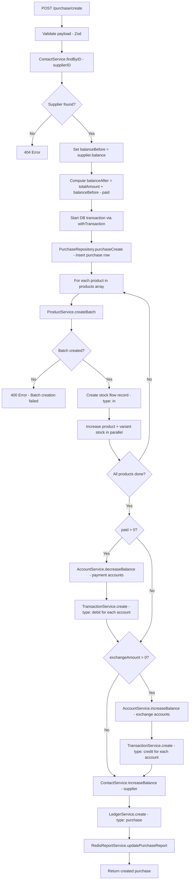
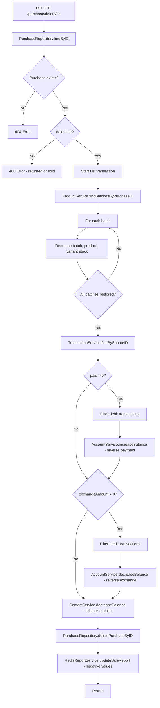

# Purchase Module Documentation

## Overview

The Purchase module records incoming inventory (products bought from suppliers), handles payments from accounts, updates supplier due/advance balances, creates batch records for each purchased product, and manages stock flow.

**Base route:** `/purchase`

| Method | Endpoint | Description |
|--------|----------|-------------|
| POST | `/purchase/create` | Create a new purchase |
| GET | `/purchase/list` | Paginated purchase list |
| GET | `/purchase/purchaseInvoiceByID/:id` | Purchase invoice details (with batches) |
| DELETE | `/purchase/delete/:id` | Delete a purchase (if `deletable`) |

All routes require `authMiddleware` (JWT).

---

## File Structure

| File | Responsibility |
|------|----------------|
| `purchase.route.ts` | Express router with validation + auth middleware |
| `purchase.controller.ts` | Thin HTTP handlers (req -> service -> JSON response) |
| `purchase.service.ts` | Business logic (create, delete, list, invoiceByID) |
| `purchase.repository.ts` | Database queries (Drizzle ORM) |
| `purchase.table.ts` | Drizzle schema (`purchases` table) + relations + `pgSequence` |
| `purchase.type.ts` | TypeScript types inferred from table + Zod schemas |
| `purchase.validator.ts` | Zod request validation schemas |
| `purchase.test.ts` | Unit tests (legacy Mongoose placeholder, not updated) |
| `purchaseCounter.model.ts` | Legacy Mongoose counter (no longer used; invoice_no now uses PostgreSQL sequence) |

---

## Data Model

### `purchases` table

| Column | Type | Description |
|--------|------|-------------|
| `id` | serial (PK) | Auto-increment primary key |
| `purchase_date` | timestamp (tz) | Purchase date, defaults to `now()` |
| `invoice_no` | integer (unique) | Auto-generated from `purchase_invoice_no_seq` (starts at 100001) |
| `supplier_id` | integer (FK -> contacts, NOT NULL) | Supplier contact reference |
| `note` | text | Optional purchase note |
| `cost_name` | varchar(255) | Optional cost name label |
| `deletable` | boolean | `false` when items are returned or sold; blocks delete |
| `total_product_price` | numeric(12,2) | Sum of product line totals |
| `other_cost` | numeric(12,2) | Extra charges |
| `discount` | numeric(12,2) | Discount applied |
| `total_amount` | numeric(12,2) | Final amount to pay |
| `paid` | numeric(12,2) | Amount paid to supplier in this purchase |
| `exchange_amount` | numeric(12,2) | Change received back from supplier |
| `balance_before` | numeric(12,2) | Supplier balance snapshot before purchase |
| `balance_after` | numeric(12,2) | Supplier balance snapshot after purchase |
| `created_at` | timestamp (tz) | Record creation timestamp |
| `updated_at` | timestamp (tz) | Record last update timestamp |

**Indexes:** `purchases_supplier_id_idx`, `purchases_invoice_no_idx`

### `batches` table (created per product during purchase)

| Column | Type | Description |
|--------|------|-------------|
| `id` | serial (PK) | Auto-increment primary key |
| `serial` | varchar (unique) | Serial number for tracked products |
| `product_id` | integer (FK -> products, cascade) | Product reference |
| `variant_id` | integer (FK -> variants) | Variant reference |
| `purchase_id` | integer (FK -> purchases, cascade) | Parent purchase |
| `cost` | numeric(12,2) | Purchase price per unit |
| `purchased_qty` | numeric(12,2) | Original quantity purchased |
| `remaining_qty` | numeric(12,2) | Current remaining stock |
| `purchase_date` | timestamp (tz) | Purchase date snapshot |
| `expire_date` | timestamp (tz, nullable) | Expiry date for perishable items |
| `is_active` | boolean | Whether batch is active |
| `created_at` | timestamp (tz) | Record creation timestamp |
| `updated_at` | timestamp (tz) | Record last update timestamp |

**Indexes:** `batches_product_idx`, `batches_variant_idx`, `batches_purchase_idx`

### Relations

```
purchases
  ├── supplier (1:1 -> contacts)
  ├── batches (1:N -> batches)
  ├── ledgers (1:1 -> ledgers)
  └── transactions (1:N -> transactions)

batches
  ├── product (N:1 -> products)
  ├── variant (N:1 -> variants)
  ├── purchase (N:1 -> purchases)
  ├── stockFlows (1:N -> stock_flows)
  └── purchaseReturnItems (1:N -> purchase_return_items)
```

---

## Zod Validation Schemas

### `createPurchaseSchema` (POST `/purchase/create`)

```json
{
  "purchase": {
    "supplierID": 5,                // required, >= 1
    "note": "string",               // optional
    "costName": "string",           // optional
    "totalProductPrice": 1000,      // >= 0
    "otherCost": 0,                 // >= 0
    "discount": 0,                  // >= 0
    "totalAmount": 1000,            // >= 0
    "paid": 500,                    // >= 0
    "exchangeAmount": 0,            // >= 0
    "balanceBefore": 200,           // computed server-side
    "balanceAfter": 700,            // computed server-side
    "purchaseDate": "2026-07-10T00:00:00.000Z"
  },
  "products": [
    {
      "productID": 1,
      "variantID": 2,
      "serial": "SN-12345",         // optional (nullable)
      "purchasedQty": 10,
      "purchasePrice": 100,
      "salePrice": 150,
      "warranty": 12,                // optional (required if serial provided)
      "expireDate": "2027-01-01"     // optional, must be after today
    }
  ],
  "accounts": [
    { "accountID": 1, "amount": 500 }
  ],
  "exchangeAccounts": [
    { "accountID": 2, "amount": 50 }
  ]
}
```

### `updatePurchaseSchema` (not wired to route)

```json
{
  "invoiceNo": "string",    // optional
  "note": "string",         // optional
  "costName": "string",     // optional
  "paid": 500,              // optional, >= 0
  "discount": 0,            // optional, >= 0
  "otherCost": 0            // optional, >= 0
}
```

### `purchaseProductSchema` cross-field rules

- If `serial` is provided, `warranty` must be > 0
- If `expireDate` is provided, it must be after today

---

## Create Purchase Flow (POST `/purchase/create`)



### Step-by-step

1. **Pre-transaction validation**
   - Resolve supplier by `supplierID` — 404 if not found
   - Compute `balanceBefore` = supplier.balance
   - Compute `balanceAfter` = totalAmount + balanceBefore - paid

2. **Inside DB transaction** (`withTransaction`)
   - **Purchase record** — insert into `purchases` table (invoice_no auto-generated by PostgreSQL sequence)
   - **Per product:**
     - Create batch record with `ProductService.createBatch` (cost, purchasedQty, remainingQty, serial, expireDate, etc.)
     - Create stock flow record (type: `in`, referenceType: `purchase`)
     - Increase product stock and variant stock in parallel
   - **Payment** (`paid > 0`):
     - `AccountService.decreaseBalance` on payment accounts (money goes out to supplier)
     - `TransactionService.create` for each account (type: `debit`)
     - **Exchange** (`exchangeAmount > 0`, nested inside payment block):
       - `AccountService.increaseBalance` on exchange accounts (change received back)
       - `TransactionService.create` for each account (type: `credit`)
   - **Supplier balance:**
     - `ContactService.increaseBalance` with `balanceAfter - balanceBefore`
   - **Ledger entry:**
     - `LedgerService.create` with type: `purchase`, payableAmount, dueAmount, balanceBefore/After

3. **Post-transaction**
   - `RedisReportService.updatePurchaseReport` (amount, qty, due, paid, discount, date)

---

## Delete Purchase Flow (DELETE `/purchase/delete/:id`)



### Step-by-step

1. Fetch purchase by ID — 404 if not found
2. Check `purchase.deletable === true` — 400 if false (items returned or sold)
3. **Inside DB transaction:**
   - Find all batches by `purchaseID`
   - Restore stock: decrease batch, product, variant stock for each batch (using `purchasedQty`)
   - Reverse payments: find debit transactions, increase account balances
   - Reverse exchange: find credit transactions, decrease account balances
   - Rollback supplier balance: `decreaseBalance(supplierID, -(balanceAfter - balanceBefore))`
   - Delete the purchase record
   - Update Redis report with negative amounts

---

## List & Invoice Endpoints

### GET `/purchase/list`

- Query params: `page`, `limit`, `search`
- `search` filters on `invoiceNo` (ilike)
- Returns: `{ items: Purchase[], total: number, page: number, limit: number }`

### GET `/purchase/purchaseInvoiceByID/:id`

Returns the purchase with:
- All purchase fields
- `batches` — all batch records linked to this purchase (via `purchaseID`)

---

## Additional Service Methods

| Method | Description |
|--------|-------------|
| `purchaseByID(id, tx?)` | Find purchase by ID, optionally within a transaction |
| `purchaseUpdateDynamic(id, payload, tx?)` | Partially update purchase fields |

These are used internally by other modules (e.g., `purchase_return`) within transactions.

---

## Dependencies

| Service | Used for |
|---------|----------|
| `ContactService` | Supplier lookup + balance update |
| `ProductService` | Batch creation, stock increase/decrease, stock flow creation |
| `AccountService` | Account balance increase/decrease |
| `TransactionService` | Payment/exchange audit trail |
| `LedgerService` | Supplier financial history |
| `RedisReportService` | Dashboard/report caching |
| `ProductRepository` | Batch lookup by purchaseID (used in invoiceByID) |

---

## Key Business Rules

- All create/delete operations use PostgreSQL transactions via `withTransaction` — partial writes are rolled back on error.
- `invoice_no` is auto-generated by a PostgreSQL sequence (`purchase_invoice_no_seq`, starts at 100001).
- Each product in the purchase creates a new batch record with `remainingQty = purchasedQty`.
- `deletable` becomes `false` when purchase items are returned or sold — delete is blocked.
- `supplierID` is required (unlike sale's optional customerID).
- Monetary fields use `numeric(12, 2)` for precision.
- Exchange handling is nested inside the payment block — exchange is only processed if a payment occurred.
