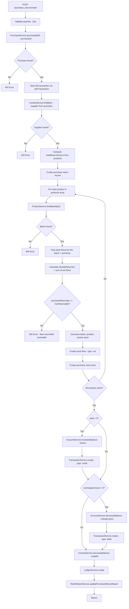
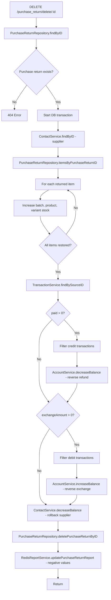

# Purchase Return Module Documentation

## Overview

The Purchase Return module records returned inventory (products sent back to suppliers), handles refund payments from accounts, updates supplier due/advance balances, decreases stock, and creates ledger entries.

**Base route:** `/purchase_return`

| Method | Endpoint | Description |
|--------|----------|-------------|
| POST | `/purchase_return/create` | Create a new purchase return |
| GET | `/purchase_return/list` | Paginated purchase return list |
| GET | `/purchase_return/purchaseByID/:id` | Purchase return invoice details (with products) |
| DELETE | `/purchase_return/delete/:id` | Delete a purchase return |

All routes require `authMiddleware` (JWT).

---

## File Structure

| File | Responsibility |
|------|----------------|
| `purchase_return.route.ts` | Express router with validation + auth middleware |
| `purchase_return.controller.ts` | Thin HTTP handlers (req -> service -> JSON response) |
| `purchase_return.service.ts` | Business logic (create, delete, list, invoiceByID) |
| `purchase_return.repository.ts` | Database queries (Drizzle ORM) |
| `purchase_return.table.ts` | Drizzle schema (`purchase_returns` + `purchase_return_items` tables) + relations |
| `purchase_return.type.ts` | TypeScript types inferred from table + Zod schemas |
| `purchase_return.validator.ts` | Zod request validation schemas |
| `purchase_return.model.ts` | Legacy Mongoose model (no longer used) |
| `purchase_return.test.ts` | Unit tests (legacy, not updated) |

---

## Data Model

### `purchase_returns` table

| Column | Type | Description |
|--------|------|-------------|
| `id` | serial (PK) | Auto-increment primary key |
| `purchase_id` | integer (FK -> purchases, NOT NULL) | Original purchase being returned |
| `supplier_id` | integer (FK -> contacts, NOT NULL) | Supplier contact reference |
| `note` | text | Optional return note |
| `total_amount` | numeric(12,2) | Total return amount |
| `paid` | numeric(12,2) | Amount refunded by supplier |
| `exchange_amount` | numeric(12,2) | Change given back to supplier |
| `discount` | numeric(12,2) | Discount applied |
| `balance_before` | numeric(12,2) | Supplier balance snapshot before return |
| `balance_after` | numeric(12,2) | Supplier balance snapshot after return |
| `date` | timestamp (tz) | Return date, defaults to `now()` |
| `created_at` | timestamp (tz) | Record creation timestamp |
| `updated_at` | timestamp (tz) | Record last update timestamp |

**Indexes:** `purchase_returns_purchase_id_idx`, `purchase_returns_supplier_date_idx` (compound)

### `purchase_return_items` table

| Column | Type | Description |
|--------|------|-------------|
| `id` | serial (PK) | Auto-increment primary key |
| `purchase_return_id` | integer (FK -> purchase_returns, cascade, NOT NULL) | Parent purchase return |
| `batch_id` | integer (FK -> batches, NOT NULL) | Batch being returned |
| `product_id` | integer (FK -> products, NOT NULL) | Product reference |
| `variant_id` | integer (FK -> variants, NOT NULL) | Variant reference |
| `purchase_returned_qty` | numeric(10,2) | Quantity returned |
| `purchase_price` | numeric(12,2) | Purchase price per unit (snapshot from batch) |
| `reason` | text | Optional reason for return |

**Indexes:** `pr_items_return_id_idx`, `pr_items_batch_id_idx`, `pr_items_variant_id_idx`

### Relations

```
purchase_returns
  ├── purchase (N:1 -> purchases)
  ├── supplier (N:1 -> contacts)
  ├── items (1:N -> purchase_return_items)
  ├── ledgers (1:1 -> ledgers)
  └── transactions (1:N -> transactions)

purchase_return_items
  ├── purchaseReturn (N:1 -> purchase_returns)
  ├── batch (N:1 -> batches)
  ├── product (N:1 -> products)
  └── variant (N:1 -> variants)
```

---

## Zod Validation Schemas

### `createPurchaseReturnSchema` (POST `/purchase_return/create`)

```json
{
  "purchaseReturn": {
    "purchaseID": 1,                // required, references original purchase
    "supplierID": 5,                // required
    "note": "string",               // optional
    "discount": 0,                  // >= 0, default 0
    "paid": 200,                    // >= 0 (refund amount)
    "exchangeAmount": 0,            // >= 0 (change given back)
    "date": "2026-07-10T00:00:00.000Z",
    "balanceBefore": 500,           // computed server-side
    "balanceAfter": 300             // computed server-side
  },
  "products": [
    {
      "productID": 1,
      "batchID": 3,
      "variantID": 2,
      "purchaseReturnQty": 5,
      "returnPrice": 100,
      "reason": "Defective item"    // optional
    }
  ],
  "accounts": [
    { "accountID": 1, "amount": 200 }
  ],
  "exchangeAccounts": [
    { "accountID": 2, "amount": 0 }
  ]
}
```

### Cross-field validation

- `purchaseReturnQty` must be positive
- `returnPrice` must be positive
- `purchaseReturnQty` must not exceed `maxReturnable` = `batch.purchasedQty - alreadyReturned`

---

## Create Purchase Return Flow (POST `/purchase_return/create`)



### Step-by-step

1. **Pre-transaction validation**
   - Fetch purchase by `purchaseID` — 404 if not found
   - Fetch supplier from purchase's `supplierID` — 404 if not found

2. **Inside DB transaction** (`withTransaction`)
   - **Purchase return record** — insert into `purchase_returns` table
   - **Per product:**
     - Fetch batch — 404 if not found
     - Find stock flows for this batch + purchase (type: `purchaseID`)
     - Calculate `alreadyReturned` = sum of `out` flows
     - Validate `purchaseReturnQty <= purchasedQty - alreadyReturned`
     - Decrease batch, product, variant stock
     - Create stock flow (type: `out`, referenceType: `purchase_return`)
     - Create purchase return item record (with batch cost snapshot)
   - **Payment** (`paid > 0`):
     - `AccountService.increaseBalance` on payment accounts (refund received)
     - `TransactionService.create` for each account (type: `credit`)
     - **Exchange** (`exchangeAmount > 0`, nested inside payment block):
       - `AccountService.decreaseBalance` on exchange accounts (change given back)
       - `TransactionService.create` for each account (type: `debit`)
   - **Supplier balance:**
     - `ContactService.decreaseBalance` with `balanceAfter - balanceBefore`
   - **Ledger entry:**
     - `LedgerService.create` with type: `purchase`, using original purchase data

3. **Post-transaction**
   - `RedisReportService.updatePurchaseReturnReport` (amount, qty, paid, discount, date)

---

## Delete Purchase Return Flow (DELETE `/purchase_return/delete/:id`)



### Step-by-step

1. Fetch purchase return by ID — 404 if not found
2. **Inside DB transaction:**
   - Fetch supplier (for balance operations)
   - Fetch all return items by `purchaseReturnID`
   - Restore stock: increase batch, product, variant stock for each item
   - Reverse payments: find credit transactions, decrease account balances
   - Reverse exchange: find debit transactions, increase account balances
   - Rollback supplier balance: `decreaseBalance(supplierID, -(balanceAfter - balanceBefore))`
   - Delete the purchase return record (cascades to purchase_return_items)
   - Update Redis report with negative amounts

---

## List & Invoice Endpoints

### GET `/purchase_return/list`

- Query params: `page`, `limit`, `search`
- `search` is available (no specific columns configured — uses default)
- Returns: `{ items: PurchaseReturn[], total: number, page: number, limit: number }`

### GET `/purchase_return/purchaseByID/:id`

Returns the purchase return with:
- `purchaseReturn` — full record with `supplier` relation
- `products` — return items with:
  - `product` — name, unit (id, name)
  - `batch` — serial, variant (id, name, attributes)

---

## Additional Service Methods

| Method | Description |
|--------|-------------|
| `list(query)` | Paginated purchase return list |
| `purchaseReturnInvoiceByID(id)` | Invoice details with products and relations |

---

## Dependencies

| Service | Used for |
|---------|----------|
| `PurchaseService` | Fetch original purchase by ID |
| `ContactService` | Supplier lookup + balance decrease |
| `ProductService` | Batch lookup, stock decrease/increase, stock flow creation |
| `AccountService` | Account balance increase/decrease |
| `TransactionService` | Refund/exchange audit trail |
| `LedgerService` | Supplier financial history |
| `RedisReportService` | Dashboard/report caching |

---

## Key Business Rules

- All create/delete operations use PostgreSQL transactions via `withTransaction`.
- Return qty is validated against `maxReturnable = batch.purchasedQty - alreadyReturned` (prevents over-returning).
- Stock flow tracks each return as type: `out` with referenceType: `purchase_return`.
- `purchase_price` in return items is snapshotted from `batch.cost` at return time.
- Payment flow is inverted compared to purchase: refund increases account balance (credit), exchange decreases it (debit).
- Supplier balance is decreased (inverted from purchase's increase).
- No `deletable` flag — purchase returns can always be deleted (unlike purchases/sales).
- Exchange handling is nested inside the payment block — exchange is only processed if a payment occurred.
- The ledger entry uses the original purchase's financial data with the return's `purchaseReturnID` linked.
