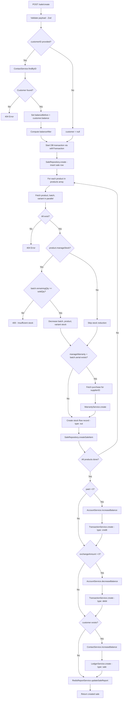
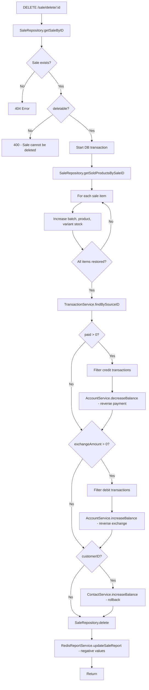

# Sale Module Documentation

## Overview

The Sale module records outgoing inventory (products sold to customers), handles payments into accounts, updates customer due/advance balances, manages batch stock (standard or FIFO), and optionally creates warranty records for serialized products.

**Base route:** `/sale`

| Method | Endpoint | Description |
|--------|----------|-------------|
| POST | `/sale/create` | Create a new sale (batch-based) |
| POST | `/sale/create-fifo-sale` | Create a new sale (FIFO auto-allocation) |
| GET | `/sale/list` | Paginated sale list |
| GET | `/sale/saleByID/:id` | Sale invoice details (with products, transactions) |
| DELETE | `/sale/delete/:id` | Delete a sale (if `deletable`) |

All routes require `authMiddleware` (JWT).

---

## File Structure

| File | Responsibility |
|------|----------------|
| `sale.route.ts` | Express router with validation + auth middleware |
| `sale.controller.ts` | Thin HTTP handlers (req -> service -> JSON response) |
| `sale.service.ts` | Business logic (create, createFifo, delete, list, invoiceByID) |
| `sale.repository.ts` | Database queries (Drizzle ORM) |
| `sale.table.ts` | Drizzle schema (`sales` table) + relations + `pgSequence` |
| `sale_items.table.ts` | Drizzle schema (`sale_items` table) + relations |
| `sale.type.ts` | TypeScript types inferred from table + Zod schemas |
| `sale.validator.ts` | Zod request validation schemas |
| `sale.test.ts` | Unit tests (legacy Mongoose placeholder, not updated) |

---

## Data Model

### `sales` table

| Column | Type | Description |
|--------|------|-------------|
| `id` | serial (PK) | Auto-increment primary key |
| `sale_date` | timestamp (tz) | Sale date, defaults to `now()` |
| `invoice_no` | integer (unique) | Auto-generated from `sale_invoice_no_seq` (starts at 100001) |
| `customer_id` | integer? (FK -> contacts) | Nullable for walk-in customers |
| `note` | text | Optional sale note |
| `cost_name` | varchar(255) | Optional cost name label |
| `deletable` | boolean | `false` when warranty is claimed; blocks delete |
| `total_product_price` | numeric(12,2) | Sum of product line totals |
| `other_cost` | numeric(12,2) | Extra charges |
| `discount` | numeric(12,2) | Discount applied |
| `total_amount` | numeric(12,2) | Final amount to pay |
| `paid` | numeric(12,2) | Amount customer paid in this sale |
| `exchange_amount` | numeric(12,2) | Change/refund given back to customer |
| `balance_before` | numeric(12,2) | Customer balance snapshot before sale |
| `balance_after` | numeric(12,2) | Customer balance snapshot after sale |
| `created_at` | timestamp (tz) | Record creation timestamp |
| `updated_at` | timestamp (tz) | Record last update timestamp |

**Indexes:** `sales_customer_id_idx`, `sales_invoice_no_idx`

### `sale_items` table

| Column | Type | Description |
|--------|------|-------------|
| `id` | serial (PK) | Auto-increment primary key |
| `sale_id` | integer (FK -> sales, cascade) | Parent sale |
| `product_id` | integer (FK -> products) | Product reference |
| `variant_id` | integer (FK -> variants) | Variant reference |
| `batch_id` | integer (FK -> batches) | Batch reference |
| `sold_qty` | numeric(10,2) | Quantity sold |
| `sale_price` | numeric(12,2) | Price per unit |
| `warranty` | integer | Warranty period (months/days) |

**Indexes:** `sale_items_sale_id_idx`, `sale_items_product_id_idx`, `sale_items_batch_id_idx`

### Relations

```
sales
  ├── customer (1:1 -> contacts)
  ├── items (1:N -> sale_items)
  ├── transactions (1:N -> transactions)
  └── ledgers (1:1 -> ledgers)

sale_items
  ├── sale (N:1 -> sales)
  ├── product (N:1 -> products)
  ├── batch (N:1 -> batches)
  └── variant (N:1 -> variants)
```

---

## Zod Validation Schemas

### `createSaleSchema` (POST `/sale/create`)

```json
{
  "sale": {
    "customerID": 5,                // optional (walk-in = null)
    "note": "string",               // optional
    "costName": "string",           // optional
    "totalProductPrice": 1000,      // >= 0
    "otherCost": 0,                 // >= 0
    "discount": 0,                  // >= 0
    "totalAmount": 1000,            // >= 0
    "paid": 500,                    // >= 0
    "exchangeAmount": 0,            // >= 0
    "balanceBefore": 200,           // computed server-side
    "balanceAfter": -300,           // computed server-side
    "saleDate": "2026-07-10T00:00:00.000Z"
  },
  "products": [
    {
      "productID": 1,
      "batchID": 3,                 // optional (nullable)
      "variantID": 2,
      "soldQty": 5,
      "salePrice": 200,
      "warranty": 12                // optional (nullable)
    }
  ],
  "accounts": [
    { "accountID": 1, "amount": 500 }
  ],
  "exchangeAccounts": [
    { "accountID": 2, "amount": 50 }
  ]
}
```

### `createFifoSaleSchema` (POST `/sale/create-fifo-sale`)

```json
{
  "sale": { /* same as above */ },
  "products": [
    {
      "productID": 1,
      "variantID": 2,
      "soldQty": 5,
      "salePrice": 200
      // no batchID needed — system auto-allocates FIFO batches
    }
  ],
  "accounts": [{ "accountID": 1, "amount": 500 }],
  "exchangeAccounts": [{ "accountID": 2, "amount": 50 }]
}
```

### `updateSaleSchema` (not wired to route)

```json
{
  "invoiceNo": "string",    // optional
  "note": "string",         // optional
  "costName": "string",     // optional
  "paid": 500,              // optional, >= 0
  "discount": 0,            // optional, >= 0
  "otherCost": 0            // optional, >= 0
}
```

---

## Create Sale Flow (POST `/sale/create`)



### Step-by-step

1. **Pre-transaction validation**
   - Resolve customer if `customerID` is set; 404 if not found
   - Compute `balanceBefore` = customer.balance, `balanceAfter` = paid - (totalAmount - balanceBefore)

2. **Inside DB transaction** (`withTransaction`)
   - **Sale record** — insert into `sales` table (invoice_no auto-generated by PostgreSQL sequence)
   - **Per product:**
     - Fetch product, batch (if batchID), variant — 404 if any missing
     - If `product.manageStock` — check `batch.remainingQty >= soldQty`, then decrease batch/product/variant stock
     - If `product.manageWarranty && batch.serial` — fetch purchase for supplierID, create warranty record
     - Create stock flow record (type: `out`, referenceType: `sale`)
     - Create sale item record
   - **Payment** (`paid > 0`):
     - `AccountService.increaseBalance` on payment accounts
     - `TransactionService.create` for each account (type: `credit`)
   - **Exchange** (`exchangeAmount > 0`):
     - `AccountService.decreaseBalance` on exchange accounts
     - `TransactionService.create` for each account (type: `debit`)
   - **Customer ledger** (if customer exists):
     - `ContactService.increaseBalance` with `balanceAfter - balanceBefore`
     - `LedgerService.create` with payableAmount, dueAmount, balanceBefore/After

3. **Post-transaction**
   - `RedisReportService.updateSaleReport` (amount, qty, due, paid, discount)

---

## Create FIFO Sale Flow (POST `/sale/create-fifo-sale`)

Same overall flow as regular create, with these differences:

- **No batchID in request** — system auto-picks oldest active batches using FIFO
- **No warranty products** — throws 400 if any product has `manageWarranty = true`
- **For products without `manageStock`** — uses first available batch for stock flow + sale item
- **For products with `manageStock`** — allocates from oldest batches until `soldQty` is fulfilled:
  - Iterates `fifoBatches` (sorted oldest-first)
  - Allocates `min(available, remaining)` from each batch
  - Throws 400 if total available stock is insufficient
  - Creates stock flow + sale item per batch allocation
  - Decreases batch, product, variant stock per allocation
- **Sale record created after product processing** (unlike regular create where it's first)

---

## Delete Sale Flow (DELETE `/sale/delete/:id`)



### Step-by-step

1. Fetch sale by ID — 404 if not found
2. Check `sale.deletable === true` — 400 if false (warranty claimed)
3. **Inside DB transaction:**
   - Fetch all sale items
   - Restore stock: increase batch, product, variant stock for each item
   - Reverse payments: find credit transactions, decrease account balances
   - Reverse exchange: find debit transactions, increase account balances
   - Rollback customer balance: `increaseBalance(customerID, -(balanceAfter - balanceBefore))`
   - Delete the sale record (cascades to sale_items)
   - Update Redis report with negative amounts
4. No explicit warranty/ledger deletion — sale_items cascade on delete

---

## List & Invoice Endpoints

### GET `/sale/list`

- Query params: `page`, `limit`, `search`
- `search` filters on `invoiceNo` (ilike)
- Returns: `{ items: Sale[], total: number, page: number, limit: number }`

### GET `/sale/saleByID/:id`

Returns the sale with:
- `products` — joined sale_items with product (name, unit) and batch (serial, variant name)
- `transactions` — filtered by type (`credit` for payments, `debit` for exchange)
- Each transaction mapped to `{ name: account.name, amount }`

---

## Dependencies

| Service | Used for |
|---------|----------|
| `ContactService` | Customer lookup + balance update |
| `ProductService` | Stock check, batch/variant FIFO, stock decrease/increase, stock flow creation |
| `AccountService` | Account balance increase/decrease |
| `TransactionService` | Payment/exchange audit trail |
| `LedgerService` | Customer financial history |
| `WarrantyService` | Serial product warranty records |
| `PurchaseService` | Supplier lookup for warranty creation |
| `RedisReportService` | Dashboard/report caching |

---

## Key Business Rules

- All create/delete operations use PostgreSQL transactions via `withTransaction` — partial writes are rolled back on error.
- `invoice_no` is auto-generated by a PostgreSQL sequence (`sale_invoice_no_seq`, starts at 100001).
- Stock is reduced at batch level; batch, product, and variant stock are all updated together.
- `deletable` becomes `false` when a warranty on this sale is claimed — delete is blocked.
- `customerID` is optional — walk-in sales skip customer balance/ledger updates.
- FIFO sale rejects warranty-managed products (they require explicit batch selection).
- Monetary fields use `numeric(12, 2)` for precision.
